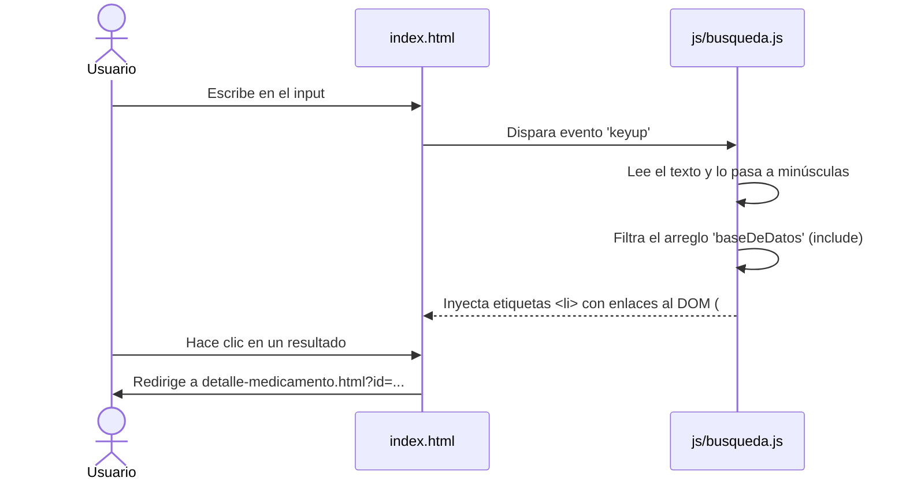
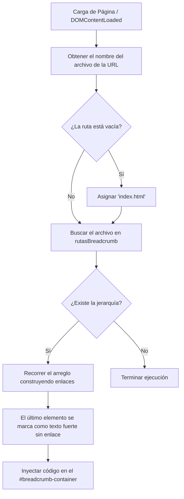
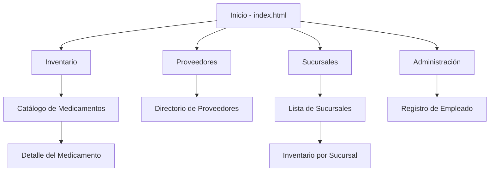

# farmacetica_proyecto
# 🏥 Farmacia "Fortaleza" - Sistema de Gestión Farmacéutica

Este proyecto es una aplicación web estática para la gestión de la Farmacia "Fortaleza". Permite a los usuarios administrar y consultar el inventario de medicamentos, visualizar el directorio de proveedores, gestionar sucursales y dar de alta a nuevos empleados. Todo el sistema opera del lado del cliente utilizando HTML, CSS y JavaScript puro ("Vanilla JS").

## ⚙️ ¿Cómo Funciona?

El sistema está dividido en varios módulos a los que se accede desde la página principal (`index.html`). No requiere un servidor backend para la demostración, ya que simula las bases de datos utilizando objetos y arreglos en memoria dentro de los archivos JavaScript.

### Campos y Archivos Importantes

1. **Módulo de Búsqueda (`js/busqueda.js`)**
   * **`baseDeDatos`**: Es un arreglo de objetos que simula el inventario. Cada medicamento tiene los campos `id`, `titulo`, `descripcion` y un `link` que redirige a la página de detalles.
   * **Evento `keyup`**: El script escucha cada vez que el usuario teclea en el buscador (`#formulario`) y filtra los medicamentos cuyo título coincida con el texto ingresado.
   * Si no hay coincidencias, inyecta un mensaje indicando que no se encontraron resultados.

2. **Detalles del Medicamento (`js/detalle_medicamento.js`)**
   * **Objeto `medicamentos`**: Actúa como una base de datos detallada utilizando el identificador del medicamento como clave (ej. `paracetamol`, `amoxicilina`). Los campos clave almacenados son: `nombre`, `concentracion`, `lote`, `caducidad` y `stock`.
   * **`URLSearchParams`**: El script lee el parámetro `?id=` de la URL para saber qué medicamento mostrar en la pantalla (ej. `detalle-medicamento.html?id=omeprazol`). 
   * **Actualización del DOM**: Cambia dinámicamente el título de la pestaña del navegador y reemplaza el contenido de texto en la página HTML para mostrar los detalles precisos.

3. **Sistema de Migas de Pan / Breadcrumbs (`js/breadcrumb.js`)**
   * **`rutasBreadcrumb`**: Es un diccionario (objeto) donde la clave es el nombre del archivo HTML actual (ej. `catalogo.html`) y el valor es un arreglo que define la jerarquía de navegación hasta llegar a esa página.
   * **`generarBreadcrumb()`**: Al cargar el DOM, esta función detecta en qué página se encuentra el usuario, busca su jerarquía en `rutasBreadcrumb` y genera dinámicamente una lista `<ul>` con los enlaces correspondientes. Luego, inyecta este HTML dentro del contenedor `
`.

---

## 📊 Diagramas de Arquitectura

### 1. Flujo de Búsqueda de Inventario
Muestra cómo interactúa el usuario con la barra de búsqueda en el inicio.

### 2. Lógica de "Migas de Pan" (Breadcrumbs)
Explica cómo el sistema sabe qué ruta de navegación mostrar en la parte superior de cada página.

### 3. Mapa del Sitio General
Estructura de cómo están conectadas las páginas principales del proyecto.

