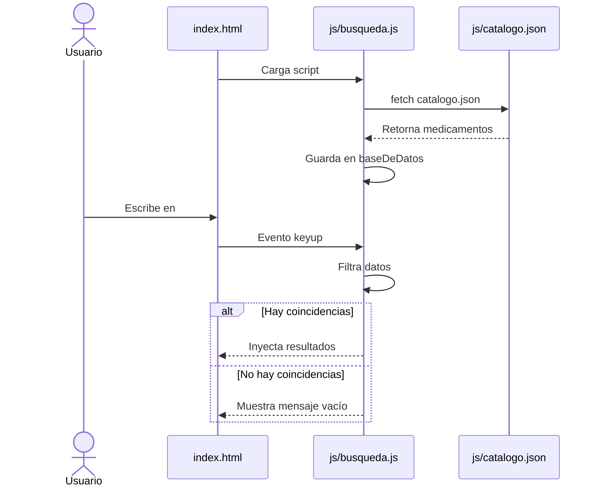
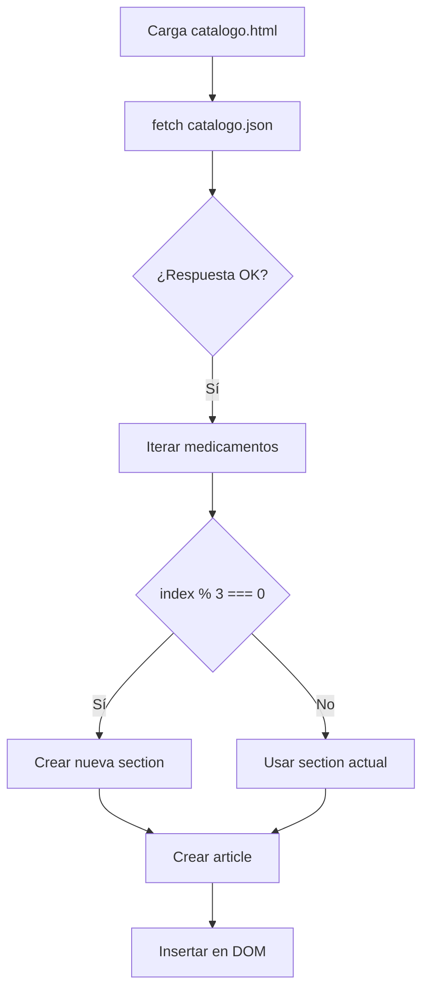
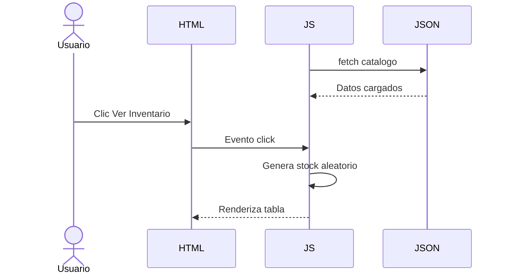

# farmacetica_proyecto

# 🏥 Farmacia "Fortaleza" - Sistema de Gestión Farmacéutica

Este proyecto es una aplicación web estática para la gestión de la Farmacia "Fortaleza". Permite a los usuarios administrar y consultar el inventario de medicamentos, visualizar el directorio de proveedores, gestionar sucursales y dar de alta a nuevos empleados.

En su versión actual, el sistema opera completamente del lado del cliente utilizando HTML, CSS y JavaScript puro (Vanilla JS), implementando cargas asíncronas mediante `fetch` para simular una base de datos real utilizando archivos JSON.

---

## ⚙️ ¿Cómo Funciona?

El sistema está dividido en módulos interconectados accesibles desde `index.html`.  

A diferencia de versiones anteriores que utilizaban objetos en memoria, esta versión implementa la API `fetch` para consumir datos desde `catalogo.json`, lo que permite una arquitectura más escalable y cercana a un entorno real con backend.

---

# 📂 Análisis Detallado de Archivos y Módulos

## 1️⃣ Módulo de Búsqueda Global (`js/busqueda.js`)

Este script controla el motor de búsqueda ubicado en la página principal.

- **Variable `baseDeDatos`**  
  Se inicializa como un arreglo vacío `[]`.  
  Se llena dinámicamente al cargar el archivo `catalogo.json`.

- **Función `cargarDatos()`**  
  Función asíncrona (`async/await`) que ejecuta:
  `fetch('../js/catalogo.json')`  
  Convierte la respuesta en JSON y almacena el resultado en `baseDeDatos`.

- **Evento `keyup` en `#formulario`**  
  Cada vez que el usuario escribe:
  - Se limpia el texto con `trim()`
  - Se convierte a minúsculas con `toLowerCase()`
  - Se ejecuta `.filter()` sobre `baseDeDatos`
  - Comparación clave:
    `item.nombre.toLowerCase().includes(texto)`

- **Inyección dinámica en el DOM**
  - Si hay coincidencias → genera `<li>` con enlaces `<a>` hacia `item.link`
  - Si no hay coincidencias → muestra "No se encontraron resultados"

---

## 2️⃣ Renderizado Dinámico del Catálogo (`pages/catalogo.html`)

Esta vista genera el catálogo leyendo el archivo `catalogo.json`.

- Ejecuta `fetch`
- Limpia el contenedor principal
- Itera sobre los medicamentos con:
  `forEach((medicamento, index) => { ... })`

### Lógica de Rejilla (Grid Modular)

Para mantener estructura visual:

- Se usa:
  `index % 3 === 0`
- Cada vez que se cumple, se crea:
  `<section class="section-medicamentos">`

Dentro de cada sección se crea:

`<article class="card-medicamentoA">`

Cada tarjeta incluye:
- `<h2>` Nombre
- `<p>` Descripción
- `<button>` con redirección a la página del medicamento

---

## 3️⃣ Gestión de Sucursales e Inventario (`pages/sucursales.html`)

Este módulo combina datos estáticos y dinámicos.

### Arreglo Estático `sucursales`

Contiene:
- nombre
- dirección
- teléfono
- horario

Se renderiza dinámicamente en tarjetas HTML.

### Modal de Inventario

Al hacer clic en **"Ver Inventario"**:

1. Se capturan atributos `data-id` y `data-nombre`
2. Se abre la ventana modal
3. Se itera sobre `medicamentosCatalogo`
4. Para cada medicamento se genera un stock aleatorio con:

`Math.floor(Math.random() * 100) + 1`

Esto produce valores entre 1 y 100 unidades.

5. Se crean filas `<tr>` dinámicamente dentro de la tabla

### Cierre del Modal

- Click en `#close-modal`
- Click fuera del contenido del modal (`window.onclick`)
- Se cambia `display: none`

---

## 4️⃣ Arquitectura de Páginas Individuales (`pages/medicamentos/`)

Cada medicamento tiene su propio archivo HTML independiente:

- acido-ascorbico.html
- omeprazol.html
- paracetamol.html
- atorvastatina.html
- sertralina.html
- etc.

### Ventajas

- Mejor SEO
- Títulos únicos (`<title>`)
- Uso de etiquetas semánticas (`<header>`, `<main>`, `<section>`)
- Mejor indexación en buscadores

---

## 5️⃣ Directorio de Proveedores (`pages/proveedores.html`)

Estructura estática con tabla:

`<table class="tabla-farmacia">`

Campos incluidos:

- Laboratorio
- Representante
- Teléfono
- Email
- Días de entrega

---

# 📊 Diagramas de Arquitectura

## 1️⃣ Flujo de Búsqueda y Carga Asíncrona



---

## 2️⃣ Generación Dinámica del Catálogo



---

## 3️⃣ Modal de Inventario por Sucursal



---

# 🚀 Guía de Instalación y Uso Local

⚠️ No abrir con `file:///`  
Generará error CORS debido al uso de `fetch`.

Para ejecutarlo correctamente:

1. Abrir la carpeta del proyecto en Visual Studio Code.
2. Instalar la extensión **Live Server**.
3. Click derecho en `index.html`.
4. Seleccionar **Open with Live Server**.
5. Se abrirá en:
   `http://127.0.0.1:5500/index.html`

---

# 📂 Estructura del Proyecto

```text
farmacetica_proyecto/
├── index.html                 # Página principal y buscador general
├── sitemap.xml                # Mapa del sitio para indexación SEO
├── README.md                  # Documentación del proyecto
├── css/
│   ├── catalogo-style.css     # Estilos específicos del grid dinámico del catálogo
│   ├── main-style.css         # Estilos globales y de la página de inicio
│   ├── provedores-style.css   # Estilos de la tabla del directorio de proveedores
│   └── sucursales-style.css   # Estilos de las tarjetas y la ventana modal
├── js/
│   ├── busqueda.js            # Lógica del buscador asíncrono y filtrado (fetch + DOM)
│   └── catalogo.json          # Base de datos simulada consumida mediante Fetch API
└── pages/
    ├── catalogo.html          # Vista dinámica del catálogo de medicamentos
    ├── proveedores.html       # Directorio de laboratorios y contactos
    ├── registro.html          # Formulario de alta para nuevos empleados
    ├── sucursales.html        # Gestión de sucursales e inventario aleatorio con modal
    └── medicamentos/          # Páginas HTML individuales para mejorar el SEO
        ├── acido-ascorbico.html
        ├── atorvastatina.html
        ├── calcio.html
        ├── carvedilol.html
        ├── clonazepam.html
        ├── dexametasona.html
        ├── fluoxetina.html
        ├── furosemida.html
        ├── loratadina.html
        ├── losartan.html
        ├── metformina.html
        ├── metoclopramida.html
        ├── omeprazol.html
        ├── paracetamol.html
        ├── salbutamol.html
        ├── sertralina.html
        ├── simvastatina.html
        ├── vitamina-d.html
        └── styles.css         # Estilos compartidos para las páginas de detalles
```
---

# 🛠️ Tecnologías Utilizadas

- HTML5 Semántico
- CSS3 (Flexbox y Grid)
- JavaScript ES6+
- Fetch API
- JSON como simulación de base de datos
