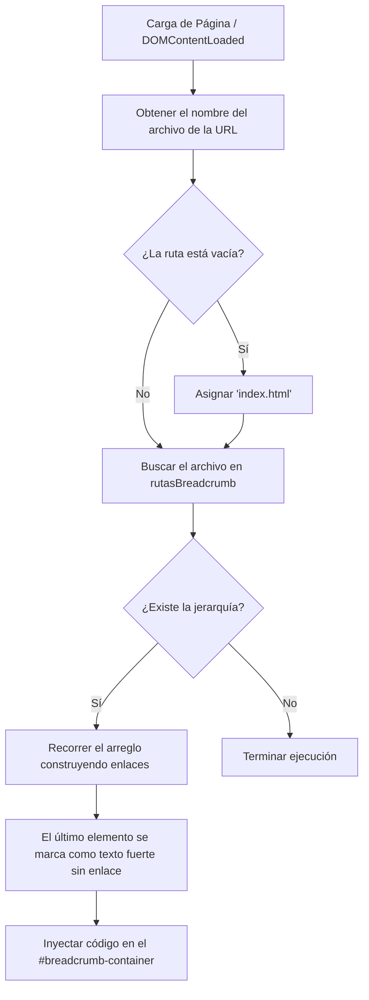
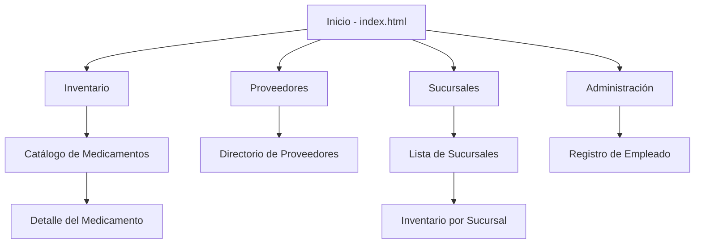
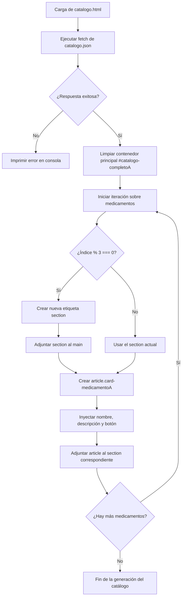
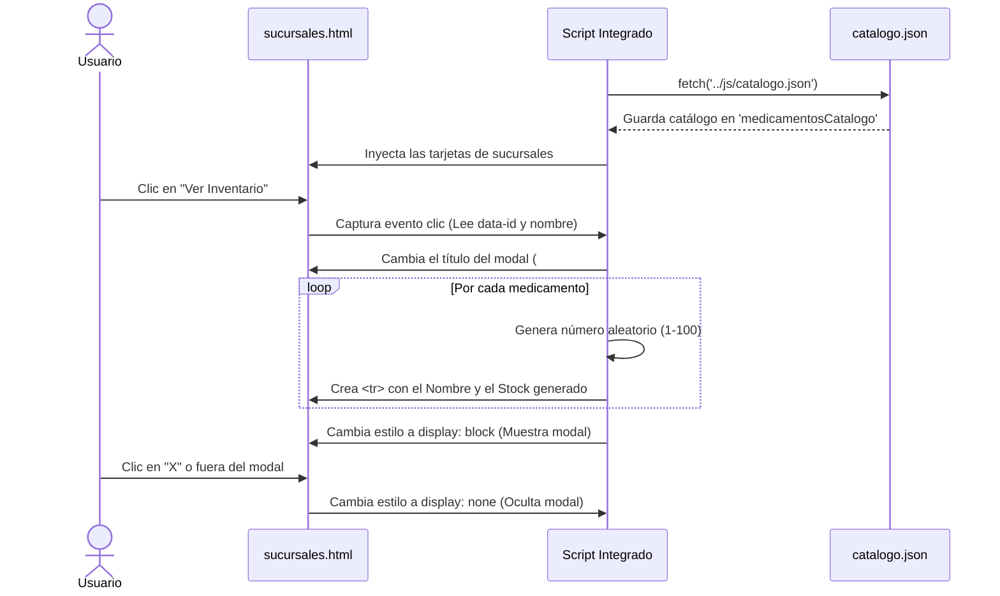

# farmacetica_proyecto
<<<<<<< HEAD
# 🏥 Farmacia "Fortaleza" - Sistema de Gestión Farmacéutica

Este proyecto es una aplicación web estática para la gestión de la Farmacia "Fortaleza". Permite a los usuarios administrar y consultar el inventario de medicamentos, visualizar el directorio de proveedores, gestionar sucursales y dar de alta a nuevos empleados. Todo el sistema opera del lado del cliente utilizando HTML, CSS y JavaScript puro ("Vanilla JS").

## ⚙️ ¿Cómo Funciona?

El sistema está dividido en varios módulos a los que se accede desde la página principal (`index.html`). No requiere un servidor backend para la demostración, ya que simula las bases de datos utilizando objetos y arreglos en memoria dentro de los archivos JavaScript.

### Campos y Archivos Importantes

1. **Módulo de Búsqueda (`js/busqueda.js`)**
   * **`baseDeDatos`**: Es un arreglo de objetos que simula el inventario. Cada medicamento tiene los campos `id`, `titulo`, `descripcion` y un `link` que redirige a la página de detalles.
   * **Evento `keyup`**: El script escucha cada vez que el usuario teclea en el buscador (`#formulario`) y filtra los medicamentos cuyo título coincida con el texto ingresado.
   * Si no hay coincidencias, inyecta un mensaje indicando que no se encontraron resultados.

2. **Detalles del Medicamento (`js/detalle_medicamento.js`)**
   * **Objeto `medicamentos`**: Actúa como una base de datos detallada utilizando el identificador del medicamento como clave (ej. `paracetamol`, `amoxicilina`). Los campos clave almacenados son: `nombre`, `concentracion`, `lote`, `caducidad` y `stock`.
   * **`URLSearchParams`**: El script lee el parámetro `?id=` de la URL para saber qué medicamento mostrar en la pantalla (ej. `detalle-medicamento.html?id=omeprazol`). 
   * **Actualización del DOM**: Cambia dinámicamente el título de la pestaña del navegador y reemplaza el contenido de texto en la página HTML para mostrar los detalles precisos.

3. **Sistema de Migas de Pan / Breadcrumbs (`js/breadcrumb.js`)**
   * **`rutasBreadcrumb`**: Es un diccionario (objeto) donde la clave es el nombre del archivo HTML actual (ej. `catalogo.html`) y el valor es un arreglo que define la jerarquía de navegación hasta llegar a esa página.
   * **`generarBreadcrumb()`**: Al cargar el DOM, esta función detecta en qué página se encuentra el usuario, busca su jerarquía en `rutasBreadcrumb` y genera dinámicamente una lista `<ul>` con los enlaces correspondientes. Luego, inyecta este HTML dentro del contenedor `<div id="breadcrumb-container">`.

---

## 📊 Diagramas de Arquitectura

### 1. Flujo de Búsqueda de Inventario
Muestra cómo interactúa el usuario con la barra de búsqueda en el inicio.
=======

# 🏥 Farmacia "Salud y Bienestar" - Documentación Técnica

Este documento detalla la arquitectura y el funcionamiento interno de la plataforma web estática de la Farmacia "Salud y Bienestar". En esta versión, el sistema ha evolucionado para simular un entorno asíncrono, consumiendo datos desde archivos JSON mediante la API `fetch`, lo que sienta las bases para una futura integración con un backend real.

## ⚙️ ¿Cómo Funciona?

El sistema está dividido en varios módulos interconectados. A diferencia de versiones anteriores, esta rama implementa el uso de la API `fetch` para cargar la información de los medicamentos desde un archivo JSON externo (`catalogo.json`), lo que lo hace mucho más dinámico y escalable.

---

## 📂 1. Análisis Detallado de Archivos y Módulos

A continuación, se desglosa el funcionamiento de cada módulo crítico del sistema, explicando las variables, funciones y métodos manipulados en el DOM.

### 1.1 Módulo de Búsqueda Global (`js/busqueda.js`)
Este script controla el motor de búsqueda ubicado en la página principal (`index.html`). 

* **Variable `baseDeDatos`**: Se inicializa como un arreglo vacío `[]`. Su propósito es almacenar en memoria el catálogo de medicamentos una vez que se obtiene del servidor (simulado por el JSON).
* **Función `cargarDatos()`**: Es una función asíncrona (`async/await`) que utiliza `fetch('../js/catalogo.json')` para solicitar la información. Convierte la respuesta en un objeto JSON y lo asigna a `baseDeDatos`.
* **Función `filtrar()`**: Se activa con el evento `keyup` (cada vez que el usuario suelta una tecla) en el input `#formulario`. 
    * Captura el valor del input, elimina espacios en blanco (`trim()`) y lo convierte a minúsculas (`toLowerCase()`).
    * Utiliza el método `.filter()` sobre `baseDeDatos` para buscar coincidencias. La validación clave es `item.nombre.toLowerCase().includes(texto)`.
    * Si hay resultados, itera con un `.forEach()` inyectando etiquetas `<li>` dinámicas en el contenedor `#resultado`, creando enlaces (`<a>`) directos hacia la ruta específica del medicamento (`item.link`).

### 1.2 Renderizado del Catálogo (`pages/catalogo.html`)
Esta vista abandona el HTML estático en favor de la generación dinámica de componentes basada en el archivo `catalogo.json`.

* **Petición Fetch Integrada**: El script embebido al final del archivo llama al JSON y procesa el arreglo de objetos.
* **Lógica de Rejilla (Grid Modular)**: 
    * Itera sobre los medicamentos usando `forEach((medicamento, index) => { ... })`.
    * Para mantener un diseño estructurado, utiliza la operación módulo `index % 3 === 0`. Cada vez que el índice es múltiplo de 3, crea dinámicamente una nueva etiqueta `<section class="section-medicamentos">` en el DOM.
    * Dentro de esa sección, crea un elemento `<article class="card-medicamentoA">` que contiene un título (`<h2>`), un párrafo (`<p>`) con la descripción y un botón `<button>` programado con un evento `onclick` que redirige a los detalles del fármaco.

### 1.3 Gestión de Sucursales y Stock Aleatorio (`pages/sucursales.html`)
Este módulo es uno de los más complejos, ya que cruza datos estáticos locales con datos dinámicos extraídos por red.

* **Arreglo Estático `sucursales`**: Define un objeto con la información (nombre, dirección, teléfono, horario) de 4 sucursales (Centro, Norte, Sur, Este).
* **Renderizado de Tarjetas (`renderizarSucursales`)**: Convierte el arreglo `sucursales` en tarjetas HTML. Cada tarjeta incluye un botón con atributos de datos personalizados (`data-id` y `data-nombre`).
* **Ventana Modal (`abrirModal`)**: 
    * Al hacer clic en "Ver Inventario", se interceptan los atributos `data-` del botón para titular la ventana modal.
    * Itera sobre el JSON global (`medicamentosCatalogo`).
    * **Simulación de Inventario**: Para cada medicamento, inyecta una fila de tabla (`<tr>`) generando un stock virtual aleatorio usando `Math.floor(Math.random() * 100) + 1`, lo que da una cifra entre 1 y 100 unidades.
* **Eventos de Cierre**: El modal se oculta cambiando el estilo `display: none` al hacer clic en la "X" (`#close-modal`) o al hacer clic fuera del contenido del modal (`window.onclick`).

### 1.4 Arquitectura de Páginas Individuales (`pages/medicamentos/`)
A diferencia de versiones que usaban parámetros de URL (`?id=`), esta versión apuesta por archivos HTML individuales para cada fármaco (ej. `acido-ascorbico.html`, `omeprazol.html`, `paracetamol.html`).
* **Ventaja**: Esta estructura mejora el SEO (Optimización para Motores de Búsqueda), ya que cada archivo cuenta con su propio `<title>`, meta descripciones (en algunos casos) y etiquetas semánticas `<header>`, `<main>` y `<section>` que separan la *Descripción*, los *Usos* y los *Efectos Secundarios* de forma nativa.

### 1.5 Directorio de Proveedores (`pages/proveedores.html`)
Mantiene una estructura estática y tabular (`<table class="tabla-farmacia">`). 
* **Campos**: Muestra el nombre del Laboratorio (Pfizer, Bayer, AstraZeneca, etc.), Representante, Teléfono, Email de Contacto y los Días de Entrega designados.

Este proyecto es una aplicación web estática para la gestión de la Farmacia "Salud y Bienestar". Permite a los usuarios administrar y consultar un catálogo de medicamentos, visualizar el directorio de proveedores, gestionar sucursales y acceder a un portal de registro. Todo el sistema opera del lado del cliente utilizando HTML, CSS y JavaScript puro, implementando cargas asíncronas para simular bases de datos reales.


### 📂 Análisis Detallado de Archivos y Módulos

1. **Módulo de Búsqueda Global (`js/busqueda.js`)**
   * **Carga de Datos (`cargarDatos`)**: Utiliza `fetch('../js/catalogo.json')` de forma asíncrona (`async/await`) para llenar el arreglo global `baseDeDatos`.
   * **Búsqueda Dinámica**: Un evento `keyup` en el input `#formulario` filtra los resultados comparando el texto ingresado con la propiedad `item.nombre` de cada objeto.
   * **Inyección en el DOM**: Los resultados coincidentes se inyectan como etiquetas `<li>` con un enlace directo (`item.link`) a los detalles del medicamento.

2. **Renderizado del Catálogo (`pages/catalogo.html`)**
   * **Generación de Tarjetas**: El archivo obtiene el catálogo mediante promesas (`fetch.then`) e itera sobre el listado de medicamentos.
   * **Estructura Modular**: Cada 3 medicamentos, el script crea dinámicamente una nueva etiqueta `<section>` y dentro inserta elementos `<article class="card-medicamentoA">` que contienen el nombre, la descripción y un botón para ver los detalles.

3. **Gestión de Sucursales y Stock Aleatorio (`pages/sucursales.html`)**
   * **Datos Estáticos y Dinámicos**: Combina un arreglo interno (`sucursales`) con la información del JSON externo (`medicamentosCatalogo`).
   * **Modal de Inventario**: Al hacer clic en "Ver Inventario" de una sucursal, se abre una ventana modal (`#modal-inventario`).
   * **Simulación de Stock**: Llena la tabla del modal iterando sobre el catálogo y asignando a cada medicamento un valor de inventario aleatorio generado con `Math.floor(Math.random() * 100) + 1`.

4. **Páginas de Detalles de Medicamentos (`pages/medicamentos/`)**
   * El proyecto contiene múltiples páginas HTML individuales estáticas para cada medicamento (ej. `omeprazol.html`, `paracetamol.html`), detallando su descripción, usos comunes y efectos secundarios, lo cual mejora drásticamente el SEO.

---

## 📊 Diagramas de Arquitectura y Flujos de Datos

### 1. Flujo de Búsqueda y Carga Asíncrona (Inicio)
Este diagrama ilustra lo que sucede detrás de escena cuando un usuario ingresa a la página principal y utiliza la barra de búsqueda.
>>>>>>> debug

```mermaid
sequenceDiagram
    actor Usuario
    participant HTML as index.html
    participant JS as js/busqueda.js
<<<<<<< HEAD
    
    Usuario->>HTML: Escribe en el input #formulario
    HTML->>JS: Dispara evento 'keyup'
    JS->>JS: Lee el texto y lo pasa a minúsculas
    JS->>JS: Filtra el arreglo 'baseDeDatos' (include)
    JS-->>HTML: Inyecta etiquetas <li> con enlaces al DOM (#resultado)
    Usuario->>HTML: Hace clic en un resultado
    HTML->>Usuario: Redirige a detalle-medicamento.html?id=...
```

### 2. Lógica de "Migas de Pan" (Breadcrumbs)
Explica cómo el sistema sabe qué ruta de navegación mostrar en la parte superior de cada página.



### 3. Mapa del Sitio General
Estructura de cómo están conectadas las páginas principales del proyecto.


=======
    participant JSON as js/catalogo.json
    
    Note over HTML,JSON: 1. Carga Inicial de la Página
    HTML->>JS: Carga el script busqueda.js
    JS->>JSON: fetch('../js/catalogo.json')
    JSON-->>JS: Retorna Array de medicamentos
    JS->>JS: Almacena datos en variable global 'baseDeDatos'
    
    Note over Usuario,JS: 2. Interacción del Usuario
    Usuario->>HTML: Escribe en #formulario
    HTML->>JS: Dispara evento 'keyup'
    JS->>JS: Convierte texto a minúsculas y limpia espacios
    JS->>JS: Filtra 'baseDeDatos' comparando con 'item.nombre'
    
    alt Hay coincidencias
        JS-->>HTML: Inyecta etiquetas <li> con enlaces <a> en #resultado
    else No hay coincidencias
        JS-->>HTML: Inyecta mensaje "No se encontraron resultados" en #resultado
    end
```

### 2. Generación Dinámica del Catálogo
Explica el algoritmo utilizado en `pages/catalogo.html` para construir la vista de cuadrícula (grid) leyendo el archivo JSON.



### 3. Lógica del Modal e Inventario de Sucursales
Detalla cómo la página de sucursales genera un stock aleatorio en tiempo real al abrir la ventana modal.



---

## 🚀 Guía de Instalación y Uso Local

Dado que esta rama del proyecto implementa la API `fetch` para consumir el archivo `catalogo.json`, **no es posible abrir los archivos HTML directamente dando doble clic** en el explorador de archivos (`file:///...`). Esto generaría un error de **CORS** (Cross-Origin Resource Sharing).

Para ejecutar el proyecto correctamente en tu computadora:

1. **Clonar o descargar el repositorio** y abrir la carpeta raíz en tu editor de código preferido (ej. Visual Studio Code).
2. **Instalar una extensión de servidor local**, por ejemplo, **Live Server** en VS Code.
3. Hacer clic derecho sobre el archivo `index.html` y seleccionar **"Open with Live Server"**.
4. El proyecto se abrirá automáticamente en tu navegador predeterminado bajo una dirección local (ej. `http://127.0.0.1:5500/index.html`), permitiendo que las peticiones asíncronas funcionen correctamente.

---

## 📂 Estructura de Carpetas

```text
farmacetica_proyecto/
├── index.html                 # Página principal y buscador
├── sitemap.xml                # Mapa del sitio para SEO
├── README.md                  # Documentación del proyecto
├── css/
│   ├── catalogo-style.css     # Estilos específicos del grid del catálogo
│   ├── main-style.css         # Estilos globales e inicio
│   ├── provedores-style.css   # Estilos de la tabla de proveedores
│   └── sucursales-style.css   # Estilos de tarjetas y modal de sucursales
├── js/
│   ├── busqueda.js            # Lógica del buscador asíncrono
│   └── catalogo.json          # Base de datos simulada
└── pages/
    ├── catalogo.html          # Vista dinámica del catálogo
    ├── proveedores.html       # Directorio de laboratorios
    ├── registro.html          # Formulario de alta de empleados
    ├── sucursales.html        # Gestión de sucursales y modal de stock
    └── medicamentos/          # Páginas individuales de cada fármaco
        ├── acido-ascorbico.html
        ├── omeprazol.html
        ├── paracetamol.html
        └── ...
```

## 🚀 Guía de Instalación y Uso Local

Dado que esta rama del proyecto (`debug`) implementa la API `fetch` para consumir el archivo `catalogo.json` de forma asíncrona, **no es posible abrir los archivos HTML directamente dando doble clic** en el explorador de archivos (`file:///...`). Esto generaría un error de **CORS** (Cross-Origin Resource Sharing) en el navegador debido a las políticas de seguridad.

Para ejecutar el proyecto correctamente en tu computadora local:

1. **Clonar o descargar el repositorio** y abrir la carpeta raíz en tu editor de código preferido (ej. Visual Studio Code).
2. **Instalar una extensión de servidor local**, por ejemplo, **Live Server** en VS Code.
3. Hacer clic derecho sobre el archivo `index.html` y seleccionar **"Open with Live Server"**.
4. El proyecto se abrirá automáticamente en tu navegador predeterminado bajo una dirección de localhost (ej. `http://127.0.0.1:5500/index.html`), permitiendo que las peticiones asíncronas hacia el JSON funcionen correctamente.

---

## 📂 Estructura de Carpetas

La arquitectura del proyecto está organizada de la siguiente manera para mantener la escalabilidad y la correcta separación de intereses:

```text
farmacetica_proyecto/
├── index.html                 # Página principal y buscador general
├── sitemap.xml                # Mapa del sitio para indexación SEO
├── README.md                  # Documentación del proyecto
├── css/
│   ├── catalogo-style.css     # Estilos específicos del grid dinámico del catálogo
│   ├── main-style.css         # Estilos globales y de la página de inicio
│   ├── provedores-style.css   # Estilos de la tabla del directorio de proveedores
│   └── sucursales-style.css   # Estilos de las tarjetas y la ventana modal
├── js/
│   ├── busqueda.js            # Lógica del buscador asíncrono y filtrado
│   └── catalogo.json          # Base de datos simulada (consumida vía fetch)
└── pages/
    ├── catalogo.html          # Vista dinámica del catálogo de medicamentos
    ├── proveedores.html       # Directorio de laboratorios y contactos
    ├── registro.html          # Formulario de alta para nuevos empleados
    ├── sucursales.html        # Gestión de sucursales e inventario aleatorio
    └── medicamentos/          # Páginas HTML individuales para mejorar el SEO
        ├── acido-ascorbico.html
        ├── atorvastatina.html
        ├── calcio.html
        ├── carvedilol.html
        ├── clonazepam.html
        ├── dexametasona.html
        ├── fluoxetina.html
        ├── furosemida.html
        ├── loratadina.html
        ├── losartan.html
        ├── metformina.html
        ├── metoclopramida.html
        ├── omeprazol.html
        ├── paracetamol.html
        ├── salbutamol.html
        ├── sertralina.html
        ├── simvastatina.html
        ├── styles.css         # Estilos compartidos para las páginas de detalles
        └── vitamina-d.html
```

---

## 🛠️ Tecnologías Utilizadas

* **HTML5 Semántico**: Para una estructura accesible y optimizada para motores de búsqueda.
* **CSS3**: Diseño responsivo (Grid y Flexbox), variables de entorno y transiciones sin frameworks externos.
* **Vanilla JavaScript (ES6+)**: Lógica del cliente, manipulación del DOM, delegación de eventos y consumo de promesas (`async/await` y `fetch API`).
* **JSON**: Almacenamiento de datos estructurados para simular respuestas de un servidor real.
>>>>>>> debug
